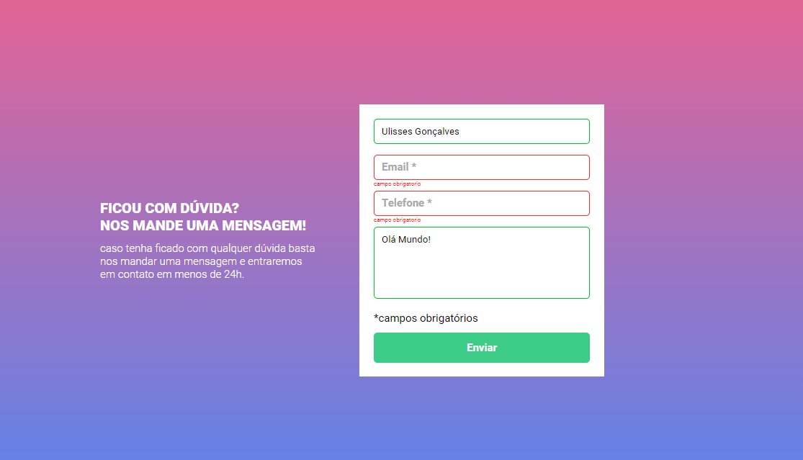

# React Rubkut





<br>

## Sobre o projeto.

O projeto de validação de entrada no formulário é um desafio para treinar a manipulação do DOM com o objetivo de explorar o conteúdo do módulo intermediário de Javascript.

## O que aprendi

Aprendi a como iniciar o processo de validação de um formulário. Tive facilidade com o html e css pois trabalho com a construção de páginas há um tempo.


## Dificuldades

Minha maior dificuldade foi separar no meu projeto as areas que receberiam as classes no javascript pois estava utilizando no projeto o forEach que além de iterar os itens iterava em bloco os seletores que estavam em escopo global. Com um laço for tradicional eu consegui implantar a solução e funcionou corretamente conforme o pedido no desafio.

<br>

<a href="https://projeto-formulario-js-intermediario.vercel.app/" target="_blank">🎁CLIQUE AQUI🎁</a> e acesse o deploy do projeto!

<br>

## 💻 Tecnologias usadas
- HTML
- CSS
- JS


## 🚀 Como Utilizar

1 - Clone o projeto

```
git clone "https://github.com/ulissesmarciano/projeto-huddle-base.git"
```
2 Acesse a pasta do projeto

```
cd projeto-huddle-base
```

3 Inicializando o projeto


Utilizando a Extensão Live Server pressione Alt+L+O


#Correções

- [x] Orientação para o tipo de botão (type="submit")
- [x] Responsividade (opcional por não ser uma exigência do projeto)
- [x] Adicionando melhorias na lógica


